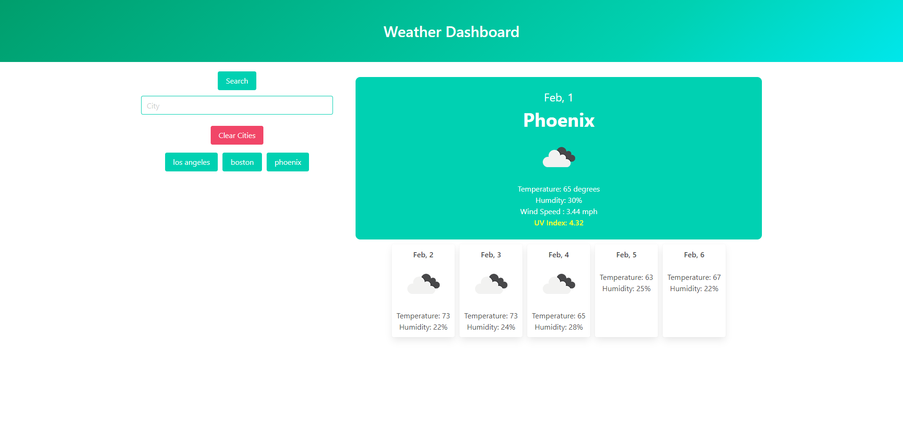

# Day-Planner

## Let's Check the Weather!

Welcome to my weather Dashboard! you can enter your desired city name and find what your current weather conditions look like, along with the next 5 days forecast as well! 

Below I have a screenshots of the application.

## Instructions

- Type in the city you're looking for
- click the search button and the info will appear on the page along with a button of the city name you just input
- the buttons are saved to local storage so don't worry about losing your results if you refresh!

## Usage
This is a simple responsive site and has
 - css
 - html
 - bulma
 - javascript
 - day.js
 - openweathermap api

## Credits
Credit to [Mike Fearnley](https://michaelfearnley.com/) and [Scott Byers](https://github.com/switch120)

and the UNH Fullstack Coding Bootcamp

## Links 
Here is the link to the deployed site: https://taylorgonz.github.io/Weather_Dashboard/
## Contact

if you want to contact me for any more questions here are my links!

hello@taylorgonz.com
 
[Website](http://www.taylorgonz.com)

## Licensing
 [General Public License](https://opensource.org/licenses/GPL-2.0)